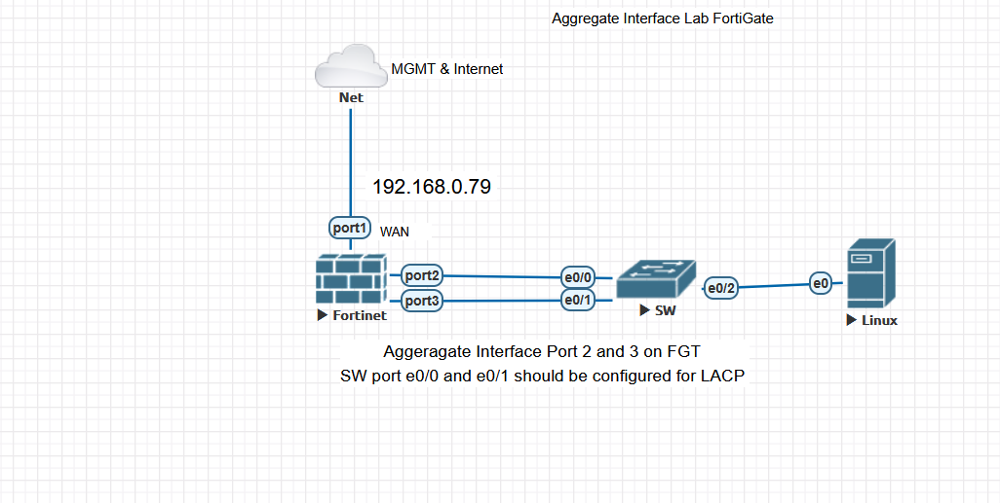

________________________________________
FortiGate Firewall Lab – Aggregate Interface (LACP) with Cisco Switch
Overview
This lab demonstrates the configuration and verification of a FortiGate firewall connected to a Cisco switch using Link Aggregation (LACP) for redundancy and throughput enhancement.
It simulates a real-world scenario where multiple links are combined to form a single logical interface for higher reliability and performance.
________________________________________
 Objective
•	Configure an Aggregate Interface (LACP) between FortiGate and Cisco switch.
•	Verify link aggregation functionality and traffic flow.
•	Enable internal LAN access with DHCP and internet reachability via the firewall.
•	Create and apply firewall policies for egress traffic.
________________________________________
Topology Diagram
 

Components:
Device	Role	Interface(s)	IP Address	Description
FortiGate VM64-KVM	Firewall	port1	192.168.0.79	WAN / Internet
 port2, port3	Aggregate Interface	LAN Zone (LACP)
Cisco Switch	Access Switch	Et0/0, Et0/1	-	Member ports of LACP group
Et0/2	-	Connected to Linux host
Linux Host	End device	e0	DHCP from FortiGate	Client verification
________________________________________
 FortiGate Configuration Steps

 

 Create Aggregate Interface
Path: Network → Interfaces → Create New → Interface → Type: 802.3ad Aggregate
Parameter	Value
Name	Aggregate lab
Type	802.3ad Aggregate
Members	port2, port3
Role	LAN
Addressing Mode	Manual
IP/Netmask	192.168.1.1/24
Administrative Access	PING
DHCP Server Range	192.168.1.2 – 192.168.1.254
Gateway	Same as Interface IP
DNS Server	Same as System DNS

 
________________________________________
 
Configure Firewall Policy

 
Path: Policy & Objects → Firewall Policy → Create New
Parameter	Setting
Name	LAN egress
Source Interface	Aggregate lab
Destination Interface	port1
Action	ACCEPT
NAT	Enabled
Security Profile	no-inspection
Logging	Enabled
  
________________________________________
 
Static Route
If needed, ensure a default route is configured towards the WAN/Internet gateway.

config router static
edit 1
set dst 0.0.0.0/0
set gateway 192.168.0.1
set device port1
next
end
________________________________________
 Cisco Switch Configuration
1️⃣ Configure Interfaces and Port-Channel
Switch(config)# interface range e0/0 - 1
Switch(config-if-range)# switchport mode trunk
Switch(config-if-range)# channel-group 1 mode active
Switch(config-if-range)# exit
2️⃣ Verify EtherChannel Status
Switch# show etherchannel summary

Expected Output:
Group  Port-channel  Protocol  Ports
------+--------------+----------+---------------------------
1      Po1(SU)       LACP      Et0/0(P) Et0/1(P)
 Check LACP Neighbors
Switch# show lacp neighbor
 

 
________________________________________
✅ Verification and Testing
1️⃣ Interface Aggregation Status on FortiGate
 
Both member interfaces (port2 and port3) show UP under the aggregate group.
2️⃣ Connectivity Test
A Linux client obtains IP via DHCP and has Internet access.
 
 
 
Successful ping to 8.8.8.8 verifies:
•	LACP aggregation working as expected
•	DHCP functioning properly
•	Firewall egress policy allowing outbound traffic
________________________________________
Key Learnings
•	Implementing LACP (802.3ad) for link redundancy and increased bandwidth.
•	Integration between FortiGate and Cisco switch in an enterprise-like environment.
•	Using FortiGate DHCP server and NAT policy for controlled LAN-to-WAN communication.
•	End-to-end verification of connectivity and fault tolerance.
________________________________________
 Conclusion
This lab validates your understanding of:
•	Network interface aggregation (LACP)
•	Firewall-to-switch integration
•	Policy creation and traffic verification
It’s a great addition to your GitHub portfolio for showcasing hands-on Fortinet and Cisco network engineering skills.

