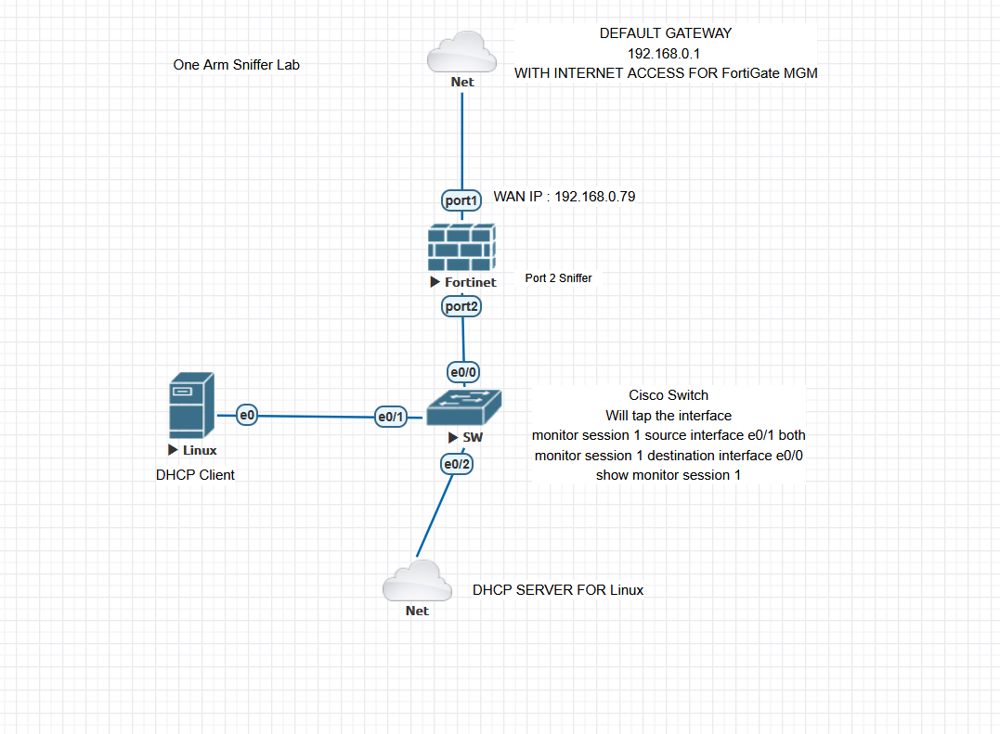
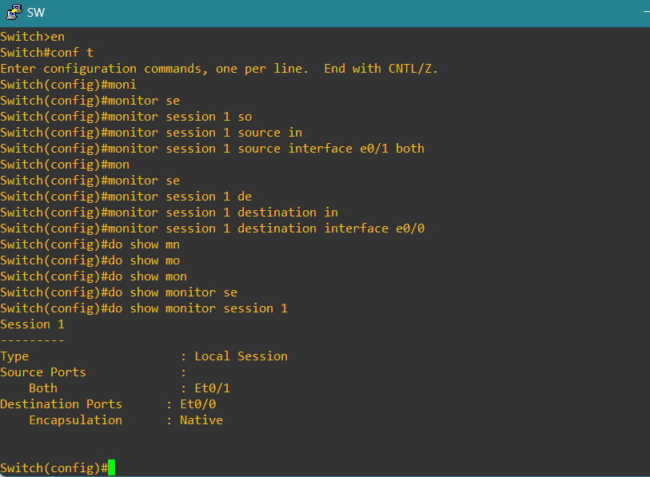
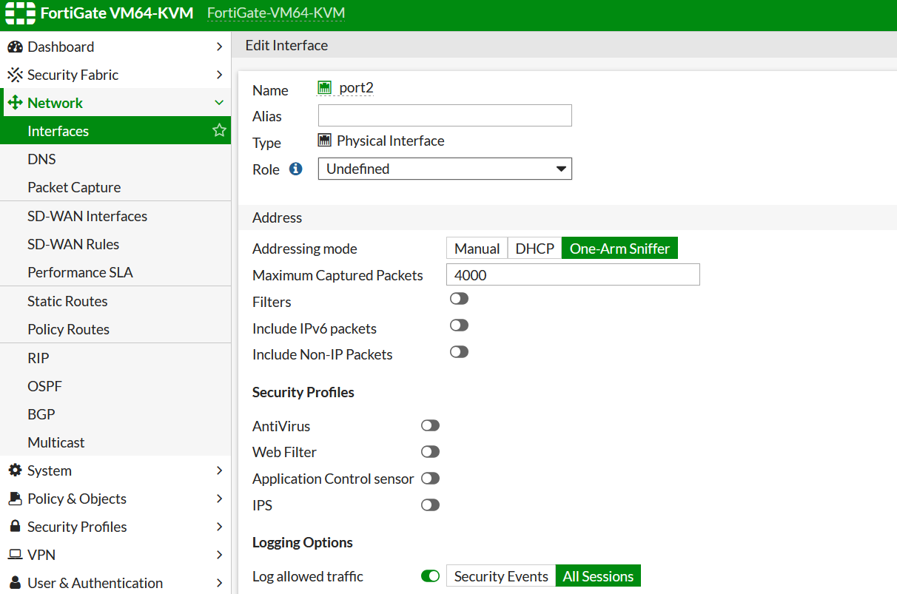

FortiGate One-Arm Sniffer Lab (Full Traffic Capture – GUI Based)
________________________________________
Overview
This lab demonstrates how to configure a FortiGate Firewall in One-Arm Sniffer Mode to capture and analyze mirrored network traffic using the FortiGate GUI Packet Capture tool.
A Cisco Switch SPAN (Switched Port Analyzer) session was configured to mirror all traffic from a network segment to the FortiGate’s sniffer interface (port2).
The objective is to observe ICMP (ping), and HTTPS communication in real time, simulating how security engineers inspect network behavior without affecting production traffic.
________________________________________
Network Topology
 

Description
•	FortiGate (FGT) operates as a passive sniffer, listening on port2 for mirrored traffic.
•	Cisco Switch mirrors packets from a client-server segment toward the FortiGate.
•	Linux DHCP Client requests IP configuration and generates additional test traffic.
•	Linux DHCP Server provides IP addresses and responds to network queries.
•	FortiGate port1 connects to the WAN (192.168.0.79) for management and internet access.
________________________________________
Components
Device	Role	Description
FortiGate VM	Sniffer	Captures mirrored packets (port2)
Cisco Switch	Layer 2	Configured with SPAN/port mirror
Linux Client	DHCP + Ping + HTTPS Tester	Generates multiple traffic types
Linux Server	DHCP Server	Provides dynamic IPs
Internet (WAN)	Gateway	192.168.0.1 – management and external connectivity
________________________________________
IP Addressing Scheme
Interface	IP Address	Role
FortiGate port1 (WAN)	192.168.0.79	Management + Internet
FortiGate port2 (Sniffer)	N/A	Sniffer interface receiving mirrored traffic
Default Gateway	192.168.0.1	Internet gateway
DHCP Server	192.168.1.1	DHCP service
DHCP Client	DHCP assigned	Receives dynamic IP
________________________________________
Cisco Switch SPAN Configuration
enable
configure terminal
monitor session 1 source interface e0/1 both
monitor session 1 destination interface e0/0
show monitor session 1
end
Explanation
•	Source: e0/1 – interface connected to the client
•	Destination: e0/0 – interface connected to FortiGate port2
•	Mirrors both inbound and outbound packets for complete visibility
________________________________________
FortiGate Configuration (GUI)
1️⃣ Access the FortiGate GUI
•	Browse to https://192.168.0.79
•	Log in with admin credentials.
2️⃣ Open Packet Capture Menu
Network → Packet Capture
3️⃣ Create a New Capture Session
Setting	Value
Interface	port2
Source/Destination	Any
Filter Expression	none (to capture all traffic) or host 192.168.1.x for targeted testing
Packet Count	500 (or custom)
Action	Start Capture
No filter was used in this lab to capture all protocols, including DHCP, ICMP, and HTTPS.
4️⃣ Monitor Real-Time Packets
Packets begin appearing in the GUI viewer immediately.
Captured traffic includes:
•	DHCP Discover/Offer/Request/ACK
•	ICMP Echo Request and Reply
•	TCP 3-way handshake
•	HTTPS session establishment and encrypted payloads
5️⃣ Download the Capture
After testing:
1.	Click Stop
2.	Click Download to save as capture.pcap
3.	Open the file in Wireshark for detailed analysis.

________________________________________
Traffic Verification & Captured Protocols
Protocol	Description	Verification
DHCP	Client ↔ Server lease exchange	DHCP Discover, Offer, Request, ACK captured
ICMP	Ping tests to gateway and external IP	Echo Request/Reply visible
HTTPS	Browser test to https://google.com
TCP handshake + TLS session seen (SSL Client Hello, Server Hello)
ARP	Local resolution and broadcast lookup	Visible ARP requests and replies
Example Wireshark View:
•	DHCP Offer from 192.168.1.1 → Client
•	ICMP Echo Reply from 8.8.8.8 → Client
•	TLS Client Hello packets from browser test
________________________________________
Sample Capture Snapshot
Frame No.	Source	Destination	Protocol	Info
12	192.168.1.1	255.255.255.255	DHCP Offer	Server offering IP
38	192.168.1.10	8.8.8.8	ICMP	Echo Request
39	8.8.8.8	192.168.1.10	ICMP	Echo Reply
74	192.168.1.10	172.217.x.x	TLSv1.3	Client Hello (Google HTTPS)
________________________________________
Key Learning Points
•	Configure FortiGate GUI Packet Capture for full-traffic analysis
•	Utilize SPAN/port mirroring to send copies of packets to a sniffer
•	Analyze multiple protocols (DHCP, ICMP, HTTPS) within a single capture
•	Export captures to Wireshark for deeper inspection
•	Understand how one-arm sniffers support network monitoring and security audits
________________________________________

Tools Used
Tool	Purpose
FortiGate VM (FortiOS)	Packet capture and analysis via GUI
Cisco Virtual Switch	SPAN traffic mirroring
Linux Server	DHCP Service Provider
Linux Client	DHCP, Ping and Browser Traffic
EVE-NG 	Virtual Lab Platform
Wireshark	Offline Packet Inspection and Protocol Decoding
________________________________________
Results
The FortiGate One-Arm Sniffer Lab successfully captured a wide range of traffic types using the GUI packet capture utility:
•	DHCP traffic: Observed full lease negotiation sequence.
•	ICMP traffic: Confirmed bidirectional ping responses.
•	HTTPS sessions: Captured TLS handshake and encrypted payload frames.
This validated the FortiGate’s capability to serve as a non-intrusive monitoring device capable of analyzing live traffic for network and security diagnostics.
________________________________________
Conclusion
The GUI-based packet capture on FortiGate provides:
•	Real-time visibility into network traffic
•	Easy export to Wireshark
•	Support for multi-protocol analysis
 
  

  
 
 
 
 
 
 
________________________________________

