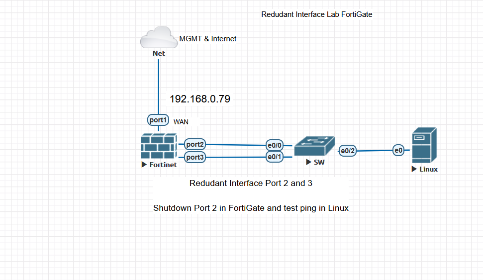
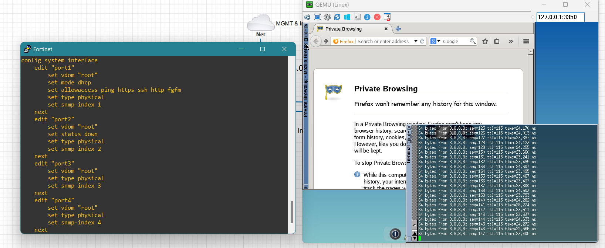

FortiGate Redundant Interface Lab - Failover Test
________________________________________
This lab demonstrates the configuration and testing of a Redundant Interface setup on a FortiGate
firewall. The redundant interface provides network resilience by using multiple physical interfaces
as a single logical interface. If one physical link fails, traffic automatically fails over to the secondary
link without disruption.
________________________________________

Network Topology

 

The network consists of the following components: FortiGate Firewall with WAN connectivity via
port1 to the Internet. Redundant Interface configured using port2 and port3 as member
interfaces. Switch connecting the redundant ports to the Linux host. Linux Client used for testing
connectivity and failover verification.
________________________________________

FortiGate Configuration

The redundant interface was created with the following settings: Interface Members: port2 and
port3 IP Address: 192.168.1.1/24 DHCP Server: Enabled (Range: 192.168.1.2–192.168.1.254)
Administrative Access: PING Role: LAN
________________________________________
Firewall Policy

 
A firewall policy was created to allow LAN (redundant interface) traffic to access the Internet via
port1. NAT was enabled to ensure outbound connectivity.
________________________________________
Static Route
 
 
A default route (0.0.0.0/0) was configured using the dynamic gateway (192.168.0.1) via interface
port1.
________________________________________
Redundant Interface Settings (GUI)
 
 

The GUI configuration confirms the redundant interface named 'LAN connectivity (Redundant lab)'
has both ports (port2 and port3) as members. This configuration ensures seamless failover
between the two physical interfaces.
________________________________________
CLI and Failover Testing

Using the CLI, port2 was manually shut down to simulate a link failure: config system interface edit
"port2" set status down next end While port2 was down, the redundant interface automatically failed
over to port3. The Linux client maintained continuous connectivity, confirmed by uninterrupted ping
responses to 8.8.8.8 and successful web browsing.
 
________________________________________
Test Results and Conclusion
The redundant interface configuration on the FortiGate functioned as expected. When port2 was
disabled, traffic immediately switched to port3 without any noticeable network interruption. The
Linux client maintained Internet access via ping and browser tests, demonstrating the effectiveness
of FortiGate's link redundancy.

