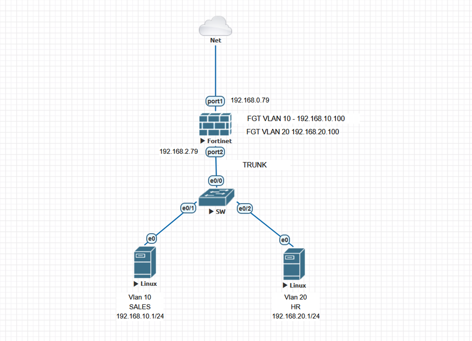
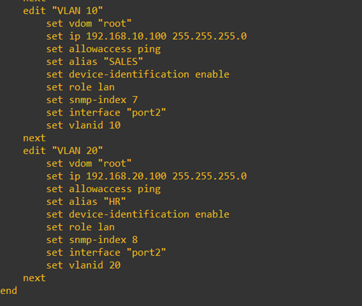
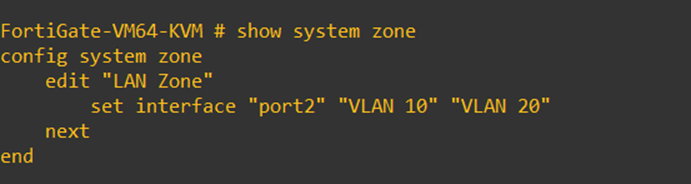
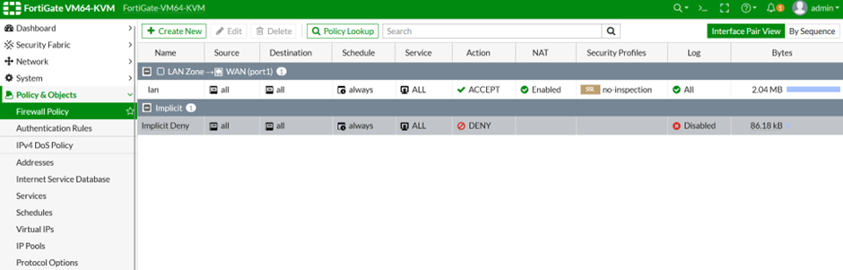
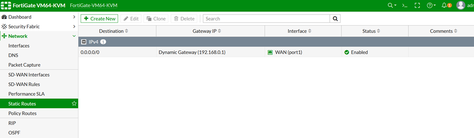
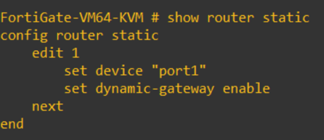
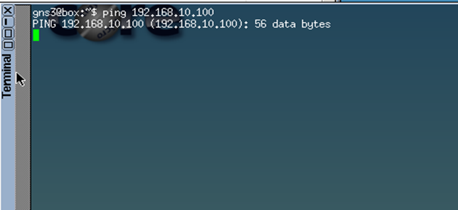
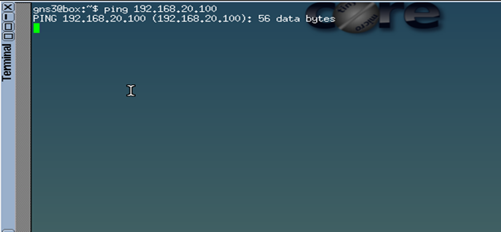

FortiGate Firewall VLAN Segmentation and Zone Lab

Network Topology
 

Overview
This lab demonstrates a FortiGate Firewall configuration for VLAN-based network segmentation, inter-VLAN routing, and internet access using a simulated environment (EVE-NG).
The project showcases practical skills in:
•	VLAN tagging and trunking
•	FortiGate logical interface setup
•	Zone-based firewall policies
•	NAT and WAN connectivity
________________________________________
Network Topology Details
Components
Device	Role	Description
FortiGate (FGT)	Firewall	Provides routing, VLAN tagging, NAT, and security policies
Switch (SW)	Layer 2 Cisco Switch	Trunk connection to FortiGate; Access ports for VLAN 10 and VLAN 20
Linux Server 1	VLAN 10 - Sales Dept	192.168.10.1/24
Linux Server 2	VLAN 20 - HR Dept	192.168.20.1/24
Internet / WAN	External Network	Simulated public network access
________________________________________
IP Addressing Scheme
Interface	VLAN	IP Address	Description
FortiGate port1 (WAN)	-	192.168.0.79	WAN interface (management + internet)
FortiGate port2 (LAN trunk)	-	192.168.2.79	Trunk link to switch for VLANs
VLAN10 (port2.10)	10	192.168.10.100	Sales VLAN gateway
VLAN20 (port2.20)	20	192.168.20.100	HR VLAN gateway
Sales Host (Linux)	10	192.168.10.1	Workstation in VLAN 10
HR Host (Linux)	20	192.168.20.1	Workstation in VLAN 20
________________________________________
 

FortiGate Configuration
 
 VLAN Interface Configuration
 
 ________________________________________

Zone Configuration

A LAN Zone was created to group VLAN 10 (Sales) and VLAN 20 (HR).
This allows unified management and reduces the number of required firewall rules.
 
Advantages of Using Zones:
•	Simplifies policy creation
•	Easier scalability when adding new VLANs
•	Reduces configuration complexity
________________________________________
Firewall Policy Configuration

Setting	Value
Incoming Interface	LAN Zone
Outgoing Interface	WAN (port1)
Source / Destination	All
Schedule	Always
Service	ALL
Action	ACCEPT
NAT	Enabled (Use Outgoing Interface Address)
Inspection Mode	Flow-based
________________________________________
Static Route Configuration

A default route was added to ensure outbound connectivity to the WAN.

 ________________________________________
Connectivity Verification

Source	Destination	Result
Sales VLAN → Internet	✅ Success	
HR VLAN → Internet	✅ Success	
Inter-VLAN	🔒 Blocked (by default)	
FortiGate → WAN	✅ Success	
________________________________________
Key Takeaways
•	VLAN trunking with FortiGate logical subinterfaces
•	Zone-based segmentation for simplified management
•	NAT-based internet access for internal users
•	Scalable design — easy to extend with new VLANs
________________________________________

 Tools Used
Tool	Purpose
FortiGate VM (FortiOS)	Firewall configuration and VLAN management
EVE-NG 	Network emulation platform
Linux Clients	Host testing for VLAN connectivity
Virtual Cisco Switch	VLAN trunk/access configuration
________________________________________
Result
No inter-vlan connectivity from VLAN 20 
 

No inter-vlan connectivity from VLAN 10
 

The lab successfully demonstrates a secure, VLAN-segmented FortiGate deployment providing WAN access, logical zoning, and layered policy control — replicating real-world enterprise firewall design principles.
Author: Jithin Vikram
💼 LinkedIn: www.linkedin.com/in/jithinvikram
💻 GitHub: https://github.com/jithinvikram
